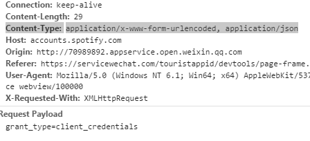
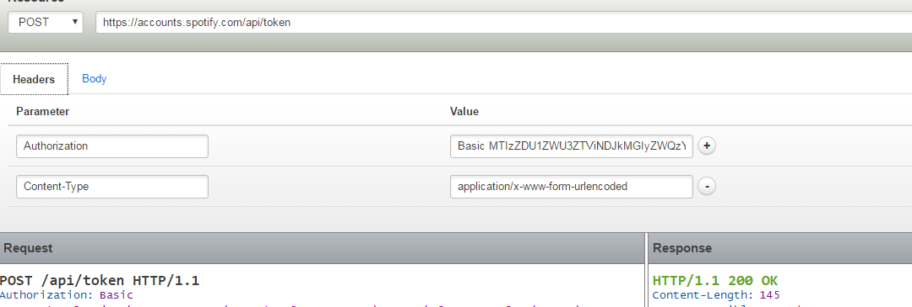

On October 4th, I sent an email to WeChat developers' support (<weixin_developer@qq.com>) regarding an issue I encountered, when I was trying to use `we.request()` to request Spotify's api (the **Client Credentials Flow** part from [Web API Authorization Guide](https://developer.spotify.com/web-api/authorization-guide/)) from WeApp. The `Content-Type` parameter of this request should be set as `application/x-www-form-urlencoded` and I did. However, the actual value `Content-Type` sent to Spotify from WeApp is `application/x-www-form-urlencoded, application/json`.


Here is my code snippet:


```javascript
function getAccessToken() {
  wx.request({
    url: "https://accounts.spotify.com/api/token",
    method: "POST",
    data: "grant_type=client_credentials",
    header: {
      "Authorization": "Basic " + btoa(CLIENT_ID + ":" + CLIENT_SECRET),
      "Content-Type": "application/x-www-form-urlencoded"
    },
    success: function(res) {
      console.log('getAccessToken-S');
      console.log(res.data);
      that.setData({
        token: res.data
      })
    },
    complete: function() {
      // console.log(CLIENT_ID + ':' + CLIENT_SECRET);
      // console.log(Base64.encode(CLIENT_ID + ':' + CLIENT_SECRET));
      console.log('getAccessToken-C');
    }
  });
}
```

As you can see, the `Content-Type` is set to `application/x-www-form-urlencoded`. However, in the IDE's network part, the `Content-Type` sent to Spotify is `application/x-www-form-urlencoded, application/json`. Somehow, this `application/json` is added on, which it should not be.

<center></center>

I have tested my request on https://apigee.com/console/ and it is working fine as following:

<center></center>


After SIX days after I reported this issue to <weixin_developer@qq.com>, I finally got a response from them with just one line:

> *Thanks for feedback. This is our bug which will be fixed in the near future.*


I will keep this post updated as long as I find this bug has been fixed or they have contacted me further.
