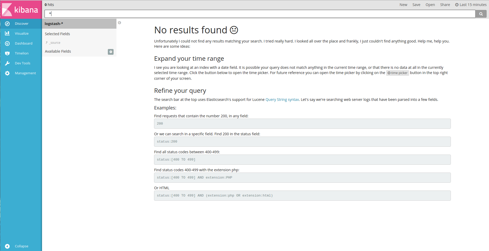
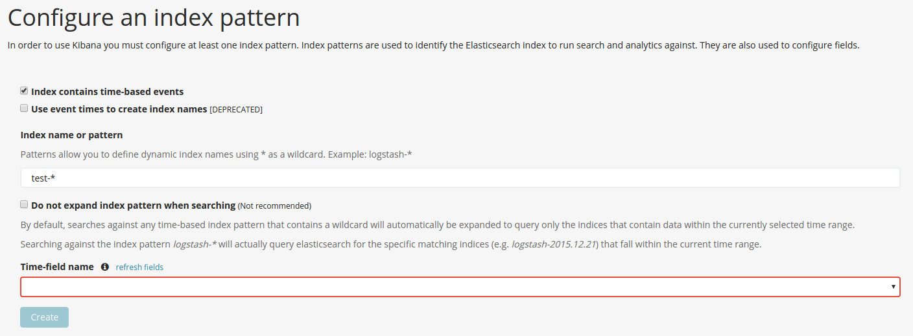
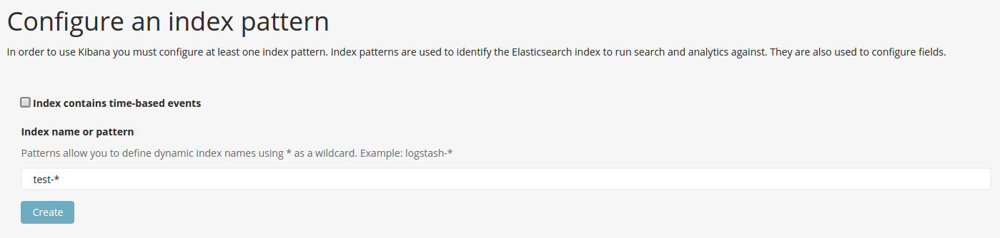
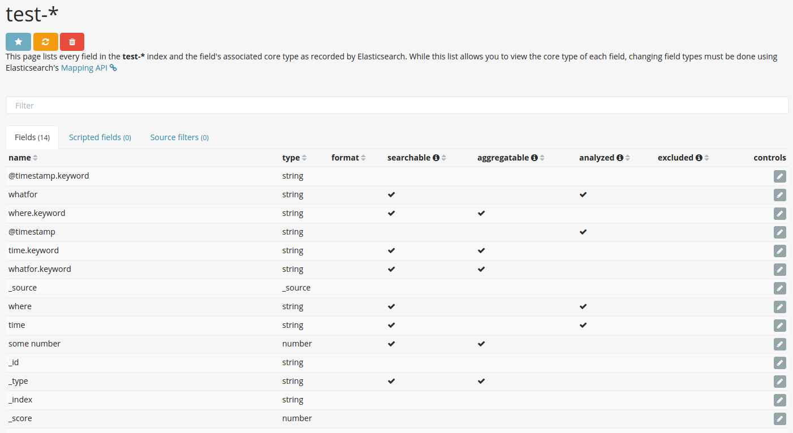
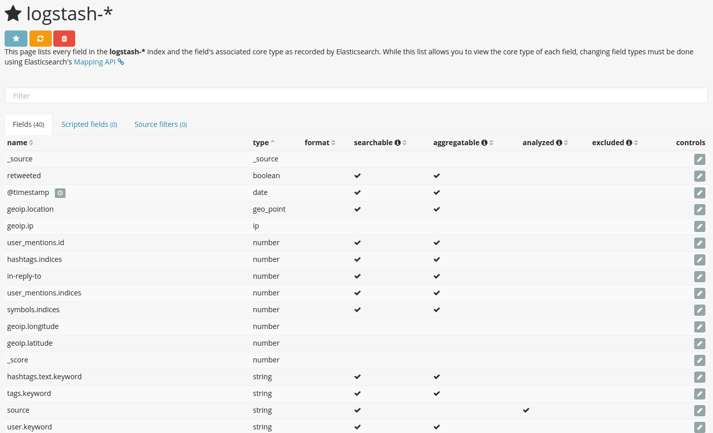
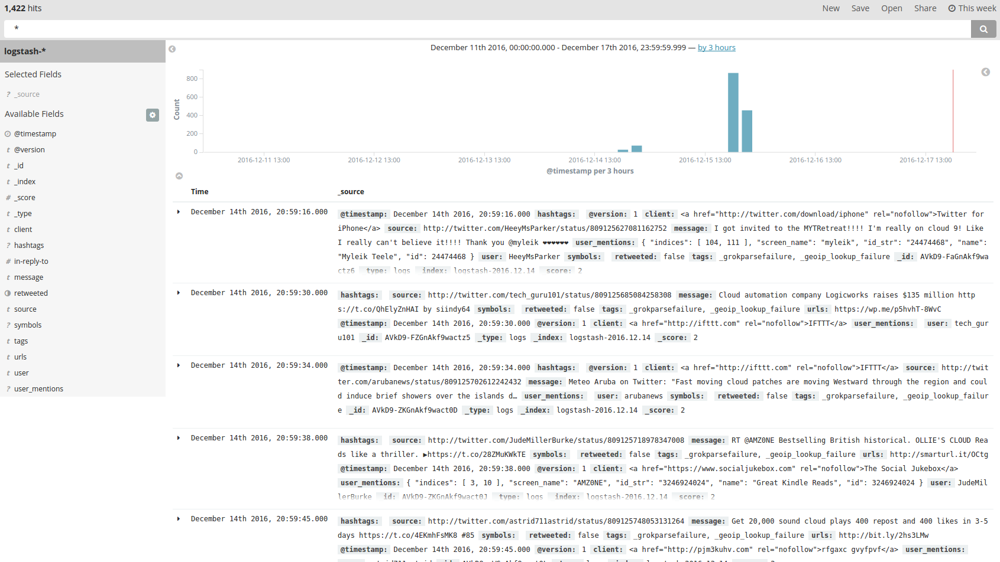
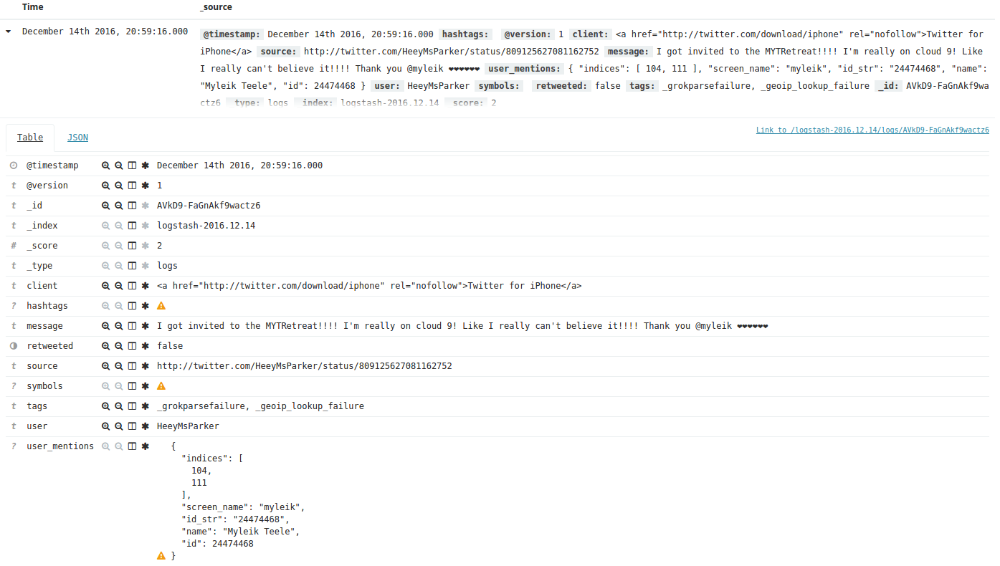

This post is mainly about my experience on setuping *[Elastic Stack](https://www.elastic.co/guide/en/elastic-stack/current/index.html)* on Ubuntu 16.04. The *ELK (Elasticsearch, Logstash, Kibana)* version I am using is 5.1.1. After Version 5.0, all products from Elasticsearch have been sharing the same versioning.

Briefly, ELK includes:

- *[Elasticsearch](https://www.elastic.co/guide/en/elasticsearch/reference/current/index.html): a highly scalable full-text search and analytics engine.*
- *[Logstash](https://www.elastic.co/guide/en/logstash/current/index.html): a data collecting, parsing, filtering, pre-processing, and mapping engine with real-time pipelining capabilities.*
- *[Kibana](https://www.elastic.co/guide/en/kibana/current/index.html): a analytics and visualization web interface designed to work with Elasticsearch for searching and viewing logs from Elasticsearch.*
- *[X-Pack](https://www.elastic.co/guide/en/x-pack/current/index.html): an Elastic Stack extention that bundles security, alerting, monitoring, reportnig, and graph capabilities into one easy-to-install package.*

All three of ELK are open source. For X-Pack, you could have a 30-day trial. Alternatively, you could also use *[Nginx](https://nginx.org/en/)* for proxy.

The data which are used for demonstrating the ELK Stack is from Twitter. Beside of ELK Stack, I will also install X-Pack since most of the companies need ELK but do not want their data/pivacy to be exposed outside.

In this setup, I will not install the software using `sudo apt-get install` on my Ubuntu. Instead, I will just download the binary files and run it in the command line. I would like to have the full control of it and also for the purpose that, if you are going to setup ELK Stack on a *Acceptance/Production* server, which requires high level of security, stability and reliability, you probably would like to do it in my way. At least you know exactly what you have done in case you screw it up, and you are able to scroll it back.

Before all, you have to check the Java version on your machine:


fluency03@fluency03:~/Documents/ELK/logstash-5.1.1$ java -version
openjdk version "1.8.0_111"
OpenJDK Runtime Environment (build 1.8.0_111-8u111-b14-2ubuntu0.16.04.2-b14)
OpenJDK 64-Bit Server VM (build 25.111-b14, mixed mode)


It is required and recommended by Elastic [here](https://www.elastic.co/guide/en/elasticsearch/reference/current/setup.html#jvm-version) that:

> *"Elasticsearch is built using Java, and requires at least Java 8 in order to run. Only Oracle’s Java and the OpenJDK are supported. The same JVM version should be used on all Elasticsearch nodes and clients. We recommend installing Java version 1.8.0_73 or later. Elasticsearch will refuse to start if a known-bad version of Java is used."*

First of all, I made a directory `ELK` for all the binaries


fluency03@fluency03:~/Documents$ mkdir ELK


THen, I had everything downloaded and untared.


fluency03@fluency03:~/Documents$ cd ELK/
fluency03@fluency03:~/Documents/ELK$ tar -xzf elasticsearch-5.1.1.tar.gz
fluency03@fluency03:~/Documents/ELK$ tar -xzf kibana-5.1.1-linux-x86_64.tar.gz
fluency03@fluency03:~/Documents/ELK$ tar -xzf logstash-5.1.1.tar.gz


After untar every package, and you will have the followings:

fluency03@fluency03:~/Documents/ELK$ ls -l
total 282808
drwxr-xr-x  9 fluency03 fluency03      4096 dec 15 20:31 elasticsearch-5.1.1/
-rw-rw-r--  1 fluency03 fluency03  33291322 dec  8 17:12 elasticsearch-5.1.1.tar.gz
drwxrwxr-x 11 fluency03 fluency03      4096 dec  6 14:06 kibana-5.1.1-linux-x86_64/
-rw-rw-r--  1 fluency03 fluency03  38909731 dec  8 17:13 kibana-5.1.1-linux-x86_64.tar.gz
drwxrwxr-x 12 fluency03 fluency03      4096 dec 15 20:38 logstash-5.1.1/
-rw-rw-r--  1 fluency03 fluency03  94043399 dec 15 20:24 logstash-5.1.1.tar.gz
-rw-rw-r--  1 fluency03 fluency03 123275957 dec 15 20:24 x-pack-5.1.1.zip


I also have the X-Pack package ready but I will set it up when the full ELK Stack is ready.

Now, if you go to the Elasticsearch directory, you will find:

fluency03@fluency03:~/Documents/ELK$ cd elasticsearch-5.1.1/
fluency03@fluency03:~/Documents/ELK/elasticsearch-5.1.1$ ls -l
total 56
drwxr-xr-x  2 fluency03 fluency03  4096 dec 15 20:21 bin/
drwxr-xr-x  2 fluency03 fluency03  4096 dec  6 13:39 config/
drwxr-xr-x  2 fluency03 fluency03  4096 dec  6 13:39 lib/
-rw-r--r--  1 fluency03 fluency03 11358 dec  6 13:34 LICENSE.txt
drwxr-xr-x 12 fluency03 fluency03  4096 dec  6 13:39 modules/
-rw-r--r--  1 fluency03 fluency03   150 dec  6 13:34 NOTICE.txt
drwxr-xr-x  2 fluency03 fluency03  4096 dec  6 13:39 plugins/
-rw-r--r--  1 fluency03 fluency03  9108 dec  6 13:34 README.textile


It is very easy to fire up Elasticsearch:

fluency03@fluency03:~/Documents/ELK/elasticsearch-5.1.1$ ./bin/elasticsearch
[2016-12-15T20:31:14,471][INFO ][o.e.n.Node               ] [] initializing ...
[2016-12-15T20:31:14,592][INFO ][o.e.e.NodeEnvironment    ] [AXYuFiP] using [1] data paths, mounts [[/ (/dev/sda2)]], net usable_space [407.3gb], net total_space [450.3gb], spins? [possibly], types [ext4]
[2016-12-15T20:31:14,593][INFO ][o.e.e.NodeEnvironment    ] [AXYuFiP] heap size [1.9gb], compressed ordinary object pointers [true]
[2016-12-15T20:31:14,593][INFO ][o.e.n.Node               ] node name [AXYuFiP] derived from node ID [AXYuFiPFRee1fLAnIMBrsQ]; set [node.name] to override
[2016-12-15T20:31:14,595][INFO ][o.e.n.Node               ] version[5.1.1], pid[32076], build[5395e21/2016-12-06T12:36:15.409Z], OS[Linux/4.4.0-51-generic/amd64], JVM[Oracle Corporation/OpenJDK 64-Bit Server VM/1.8.0_111/25.111-b14]
[2016-12-15T20:31:15,491][INFO ][o.e.p.PluginsService     ] [AXYuFiP] loaded module [aggs-matrix-stats]
[2016-12-15T20:31:15,492][INFO ][o.e.p.PluginsService     ] [AXYuFiP] loaded module [ingest-common]
[2016-12-15T20:31:15,492][INFO ][o.e.p.PluginsService     ] [AXYuFiP] loaded module [lang-expression]
[2016-12-15T20:31:15,492][INFO ][o.e.p.PluginsService     ] [AXYuFiP] loaded module [lang-groovy]
[2016-12-15T20:31:15,492][INFO ][o.e.p.PluginsService     ] [AXYuFiP] loaded module [lang-mustache]
[2016-12-15T20:31:15,492][INFO ][o.e.p.PluginsService     ] [AXYuFiP] loaded module [lang-painless]
[2016-12-15T20:31:15,492][INFO ][o.e.p.PluginsService     ] [AXYuFiP] loaded module [percolator]
[2016-12-15T20:31:15,493][INFO ][o.e.p.PluginsService     ] [AXYuFiP] loaded module [reindex]
[2016-12-15T20:31:15,493][INFO ][o.e.p.PluginsService     ] [AXYuFiP] loaded module [transport-netty3]
[2016-12-15T20:31:15,493][INFO ][o.e.p.PluginsService     ] [AXYuFiP] loaded module [transport-netty4]
[2016-12-15T20:31:15,493][INFO ][o.e.p.PluginsService     ] [AXYuFiP] no plugins loaded
[2016-12-15T20:31:17,980][INFO ][o.e.n.Node               ] initialized
[2016-12-15T20:31:17,980][INFO ][o.e.n.Node               ] [AXYuFiP] starting ...
[2016-12-15T20:31:18,228][INFO ][o.e.t.TransportService   ] [AXYuFiP] publish_address {127.0.0.1:9300}, bound_addresses {[::1]:9300}, {127.0.0.1:9300}
[2016-12-15T20:31:21,314][INFO ][o.e.c.s.ClusterService   ] [AXYuFiP] new_master {AXYuFiP}{AXYuFiPFRee1fLAnIMBrsQ}{Kecv4YQ3S_OYfpQ_cvLTlA}{127.0.0.1}{127.0.0.1:9300}, reason: zen-disco-elected-as-master ([0] nodes joined)
[2016-12-15T20:31:21,383][INFO ][o.e.h.HttpServer         ] [AXYuFiP] publish_address {127.0.0.1:9200}, bound_addresses {[::1]:9200}, {127.0.0.1:9200}
[2016-12-15T20:31:21,383][INFO ][o.e.n.Node               ] [AXYuFiP] started
[2016-12-15T20:31:21,477][INFO ][o.e.g.GatewayService     ] [AXYuFiP] recovered [0] indices into cluster_state
[2016-12-15T20:31:33,310][INFO ][o.e.c.m.MetaDataCreateIndexService] [AXYuFiP] [logstash-2016.12.14] creating index, cause [auto(bulk api)], templates [], shards [5]/[1], mappings []
[2016-12-15T20:31:34,612][INFO ][o.e.c.m.MetaDataMappingService] [AXYuFiP] [logstash-2016.12.14/HG1sGnb-RMeFe_eRVqFU9w] create_mapping [logs]
[2016-12-15T20:31:34,629][INFO ][o.e.c.m.MetaDataMappingService] [AXYuFiP] [logstash-2016.12.14/HG1sGnb-RMeFe_eRVqFU9w] update_mapping [logs]
[2016-12-15T20:31:35,201][INFO ][o.e.c.m.MetaDataMappingService] [AXYuFiP] [logstash-2016.12.14/HG1sGnb-RMeFe_eRVqFU9w] update_mapping [logs]


NOW, we have a working Elasticsearch:


fluency03@fluency03:~/Documents/ELK$ curl -XGET 'localhost:9200/?pretty'
{
  "name" : "AXYuFiP",
  "cluster_name" : "elasticsearch",
  "cluster_uuid" : "aPzW_vyDTRSG9wFgr7CFJA",
  "version" : {
    "number" : "5.1.1",
    "build_hash" : "5395e21",
    "build_date" : "2016-12-06T12:36:15.409Z",
    "build_snapshot" : false,
    "lucene_version" : "6.3.0"
  },
  "tagline" : "You Know, for Search"
}


Giving `?pretty` is used for getting a more strutured-printed reponse.

Instead of running in front, you could also run Elasticsearch as a daemon in the background like this:

./bin/elasticsearch -d -p pid


By specifying `-d`, you put the program as daemon; by giving `-p pid`, the process ID is recorded in a file, so that you can do `kill 'cat pid'` in order to kill it.


fluency03@fluency03:~/Documents/ELK$ cd kibana-5.1.1-linux-x86_64/
fluency03@fluency03:~/Documents/ELK/kibana-5.1.1-linux-x86_64$ ls -l
total 76
drwxrwxr-x   2 fluency03 fluency03  4096 dec  6 14:06 bin/
drwxrwxr-x   2 fluency03 fluency03  4096 dec  6 14:06 config/
drwxrwxr-x   2 fluency03 fluency03  4096 dec  6 14:06 data/
-rw-rw-r--   1 fluency03 fluency03   562 dec  6 14:06 LICENSE.txt
drwxrwxr-x   6 fluency03 fluency03  4096 dec  6 14:06 node/
drwxrwxr-x 471 fluency03 fluency03 20480 dec  6 14:06 node_modules/
drwxrwxr-x   3 fluency03 fluency03  4096 dec  6 14:06 optimize/
-rw-rw-r--   1 fluency03 fluency03   701 dec  6 14:06 package.json
drwxrwxr-x   2 fluency03 fluency03  4096 dec  6 14:06 plugins/
-rw-rw-r--   1 fluency03 fluency03  4962 dec  6 14:06 README.txt
drwxrwxr-x   9 fluency03 fluency03  4096 dec  6 14:06 src/
drwxrwxr-x   2 fluency03 fluency03  4096 dec  6 14:06 webpackShims/


It is also easy to start Kibana:


fluency03@fluency03:~/Documents/ELK/kibana-5.1.1-linux-x86_64$ ./bin/kibana
  log   [19:33:54.096] [info][status][plugin:kibana@5.1.1] Status changed from uninitialized to green - Ready
  log   [19:33:54.180] [info][status][plugin:elasticsearch@5.1.1] Status changed from uninitialized to yellow - Waiting for Elasticsearch
  log   [19:33:54.198] [info][status][plugin:console@5.1.1] Status changed from uninitialized to green - Ready
  log   [19:33:54.811] [info][status][plugin:timelion@5.1.1] Status changed from uninitialized to green - Ready
  log   [19:33:54.814] [info][listening] Server running at http://localhost:5601
  log   [19:33:54.814] [info][status][ui settings] Status changed from uninitialized to yellow - Elasticsearch plugin is yellow
  log   [19:33:59.839] [info][status][plugin:elasticsearch@5.1.1] Status changed from yellow to yellow - No existing Kibana index found
  log   [19:34:00.668] [info][status][plugin:elasticsearch@5.1.1] Status changed from yellow to green - Kibana index ready
  log   [19:34:00.668] [info][status][ui settings] Status changed from yellow to green - Ready


Till now, we have not had any data yet. We could `put` some simple test data as following:

fluency03@fluency03:~/Documents/ELK/elasticsearch-5.1.1$ curl -XPUT localhost:9200/test-2016.12.17/test/1234?pretty -d '{"whatfor": "test", "where": "at lib", "some number": 1234, "time": "2016.12.17T18:30:25"}'
{
  "_index" : "test-2016.12.17",
  "_type" : "test",
  "_id" : "1234",
  "_version" : 7,
  "result" : "created",
  "_shards" : {
    "total" : 2,
    "successful" : 1,
    "failed" : 0
  },
  "created" : true
}


Since there is no `date` mapping, the index `test-*` cannot be time-based:

We can create a non-time-based index:

There are the fields:

Now, let's get Logstash into play and get some real data:

fluency03@fluency03:~/Documents/ELK$ cd logstash-5.1.1/
fluency03@fluency03:~/Documents/ELK/logstash-5.1.1$ ls -l
total 204
drwxrwxr-x  2 fluency03 fluency03   4096 dec 15 20:25 bin/
-rw-rw-r--  1 fluency03 fluency03 111569 dec  6 14:12 CHANGELOG.md
drwxrwxr-x  2 fluency03 fluency03   4096 dec 15 20:25 config/
-rw-rw-r--  1 fluency03 fluency03   2249 dec  6 14:12 CONTRIBUTORS
drwxrwxr-x  3 fluency03 fluency03   4096 dec 15 20:38 data/
-rw-rw-r--  1 fluency03 fluency03    552 dec 14 20:34 first.conf
-rw-rw-r--  1 fluency03 fluency03   3834 dec  6 14:17 Gemfile
-rw-rw-r--  1 fluency03 fluency03  21182 dec  6 14:12 Gemfile.jruby-1.9.lock
drwxrwxr-x  5 fluency03 fluency03   4096 dec 15 20:25 lib/
-rw-rw-r--  1 fluency03 fluency03    589 dec  6 14:12 LICENSE
drwxrwxr-x  2 fluency03 fluency03   4096 dec 16 08:44 logs/
drwxrwxr-x  4 fluency03 fluency03   4096 dec 15 20:25 logstash-core/
drwxrwxr-x  3 fluency03 fluency03   4096 dec 15 20:25 logstash-core-event-java/
drwxrwxr-x  3 fluency03 fluency03   4096 dec 15 20:25 logstash-core-plugin-api/
drwxrwxr-x  3 fluency03 fluency03   4096 dec 15 20:25 logstash-core-queue-jruby/
-rw-rw-r--  1 fluency03 fluency03    149 dec  6 14:12 NOTICE.TXT
drwxrwxr-x  4 fluency03 fluency03   4096 dec 15 20:25 vendor/


Here's how we can start Logstash:

fluency03@fluency03:~/Documents/ELK/logstash-5.1.1$ bin/logstash -f first.conf --config.reload.automatic
Sending Logstash\'s logs to /home/fluency03/Documents/ELK/logstash-5.1.1/logs which is now configured via log4j2.properties
[2016-12-15T20:38:08,961][INFO ][logstash.setting.writabledirectory] Creating directory {:setting=>"path.queue", :path=>"/home/fluency03/Documents/ELK/logstash-5.1.1/data/queue"}
[2016-12-15T20:38:08,985][INFO ][logstash.agent           ] No persistent UUID file found. Generating new UUID {:uuid=>"a60d9b60-6fe8-409c-852b-edad3f3498b7", :path=>"/home/fluency03/Documents/ELK/logstash-5.1.1/data/uuid"}
[2016-12-15T20:38:10,170][INFO ][logstash.inputs.twitter  ] Starting twitter tracking {:track=>"cloud"}
[2016-12-15T20:38:10,389][INFO ][logstash.outputs.elasticsearch] Elasticsearch pool URLs updated {:changes=>{:removed=>[], :added=>["http://localhost:9200"]}}
[2016-12-15T20:38:10,390][INFO ][logstash.outputs.elasticsearch] Running health check to see if an Elasticsearch connection is working {:url=>#<URI::HTTP:0x3c9a6d9 URL:http://localhost:9200>, :healthcheck_path=>"/"}
[2016-12-15T20:38:10,537][WARN ][logstash.outputs.elasticsearch] Restored connection to ES instance {:url=>#<URI::HTTP:0x3c9a6d9 URL:http://localhost:9200>}
[2016-12-15T20:38:10,538][INFO ][logstash.outputs.elasticsearch] Using mapping template from {:path=>nil}
[2016-12-15T20:38:10,604][INFO ][logstash.outputs.elasticsearch] Attempting to install template {:manage_template=>{"template"=>"logstash-*", "version"=>50001, "settings"=>{"index.refresh_interval"=>"5s"}, "mappings"=>{"_default_"=>{"_all"=>{"enabled"=>true, "norms"=>false}, "dynamic_templates"=>[{"message_field"=>{"path_match"=>"message", "match_mapping_type"=>"string", "mapping"=>{"type"=>"text", "norms"=>false}}}, {"string_fields"=>{"match"=>"*", "match_mapping_type"=>"string", "mapping"=>{"type"=>"text", "norms"=>false, "fields"=>{"keyword"=>{"type"=>"keyword"}}}}}], "properties"=>{"@timestamp"=>{"type"=>"date", "include_in_all"=>false}, "@version"=>{"type"=>"keyword", "include_in_all"=>false}, "geoip"=>{"dynamic"=>true, "properties"=>{"ip"=>{"type"=>"ip"}, "location"=>{"type"=>"geo_point"}, "latitude"=>{"type"=>"half_float"}, "longitude"=>{"type"=>"half_float"}}}}}}}}
[2016-12-15T20:38:10,608][INFO ][logstash.outputs.elasticsearch] Installing elasticsearch template to _template/logstash
[2016-12-15T20:38:10,745][INFO ][logstash.outputs.elasticsearch] New Elasticsearch output {:class=>"LogStash::Outputs::ElasticSearch", :hosts=>["localhost:9200"]}
[2016-12-15T20:38:10,830][INFO ][logstash.filters.geoip   ] Using geoip database {:path=>"/home/fluency03/Documents/ELK/logstash-5.1.1/vendor/bundle/jruby/1.9/gems/logstash-filter-geoip-4.0.4-java/vendor/GeoLite2-City.mmdb"}
[2016-12-15T20:38:10,868][INFO ][logstash.pipeline        ] Starting pipeline {"id"=>"main", "pipeline.workers"=>8, "pipeline.batch.size"=>125, "pipeline.batch.delay"=>5, "pipeline.max_inflight"=>1000}
[2016-12-15T20:38:10,876][INFO ][logstash.pipeline        ] Pipeline main started
[2016-12-15T20:38:10,942][INFO ][logstash.agent           ] Successfully started Logstash API endpoint {:port=>9601}


THe parameter `--config.reload.automatic` is for automatically reloading `conf` file.

The configuration file `first.conf` is showing like:


input {
    twitter {
        consumer_key => "your_twitter_consumer_key"
        consumer_secret => "your_twitter_consumer_secret"
        keywords => ["cloud"]
        oauth_token => "your_twitter_oauth_token"
        oauth_token_secret => "your_twitter_oauth_token_secret"
    }
}
filter {
    grok {
        match => { "message" => "%{COMBINEDAPACHELOG}"}
    }
    geoip {
        source => "clientip"
    }
}
output {
    elasticsearch {
        hosts => [ "localhost:9200" ]
    }
}


The input plugin `twitter` specifies the data source you are using, with several parameters to setup related to your Twitter application info.

The filter plugins `grok` and `geoip`, repectively, are used to parse the twitter message and map the client ip address to a Geo location.

The output plugin `elasticsearch` gives Logstash the destination of the processed, filtered and mapped data, which, here, is to Elasticsearch.

Now, we have a `logstash-*` as time-based:

And we are getting data from twitter:

Here is one twitter data sample:

It can also be shown in JSON format:

{
  "_index": "logstash-2016.12.14",
  "_type": "logs",
  "_id": "AVkD9-FaGnAkf9wactz6",
  "_score": 2,
  "_source": {
    "@timestamp": "2016-12-14T19:59:16.000Z",
    "geoip": {},
    "hashtags": [],
    "@version": "1",
    "client": "<a href=\"http://twitter.com/download/iphone\" rel=\"nofollow\">Twitter for iPhone</a>",
    "source": "http://twitter.com/HeeyMsParker/status/809125627081162752",
    "message": "I got invited to the MYTRetreat!!!! I'm really on cloud 9! Like I really can't believe it!!!! Thank you @myleik ❤️️❤️️❤️️❤️️❤️️❤️️",
    "user_mentions": [
      {
        "indices": [
          104,
          111
        ],
        "screen_name": "myleik",
        "id_str": "24474468",
        "name": "Myleik Teele",
        "id": 24474468
      }
    ],
    "user": "HeeyMsParker",
    "symbols": [],
    "retweeted": false,
    "tags": [
      "_grokparsefailure",
      "_geoip_lookup_failure"
    ]
  },
  "fields": {
    "@timestamp": [
      1481745556000
    ]
  }
}

