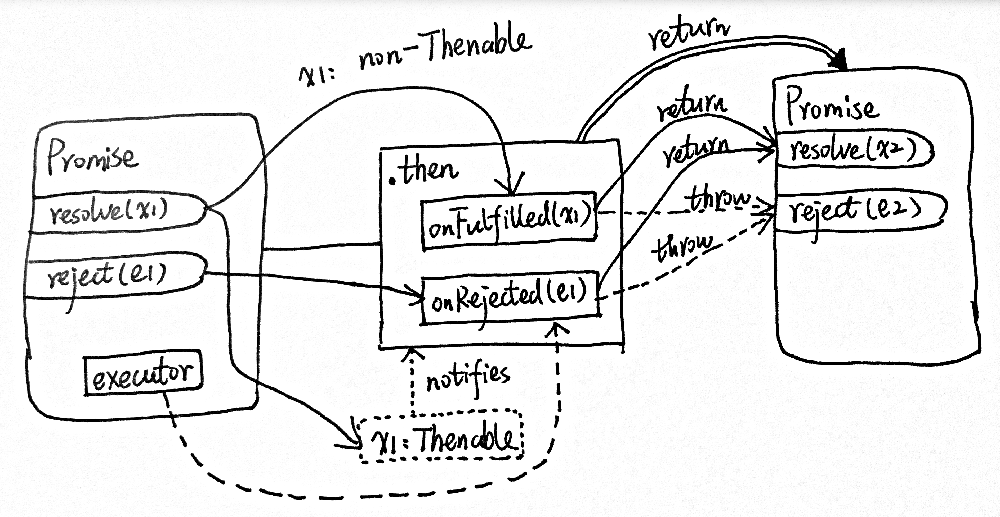

*Please see [here](#references) for the reference list. Demo code [here](https://github.com/fluency03/promise-blog).*

---

Recently, in order to avoid directly exposing my Database API to devices outside of server's newtork (such as personal laptop), I am planning to migrate my Polymer website (which is doing Database query or insert through APIs) from client-side to server-side using Node.js.


However, I eventually fell into the deeply nested callbacks, i.e., the so-called [*callback hell*](http://callbackhell.com/). Actually, I knew that I would very likely run into the callback hell since this is the first time I went deep into the implementation of the callbacks and asynchrony of JavaScript, and I knew that I will eventually move to *Promise*. I initially chose to implememnt the code in purely callback functions just because I would like to obtain deeper and practical understanding of this important concept of JavaScript.


Nevertheless, I still decided to implement Promise.


<div class="breaker"></div>


During the study of Promise, I found that it is very important to understand how (or under which circumstances) Promise is switching its states (and to which states it is switching) and what is the flow chart of a Promise chain under certain scenario. Therefore, I write this blog as a study note for myself to clearify the maze of Promise. I hope others who read this blog also will benefit from it one way or another.


According to [Promises/A+ Specifications](https://promisesaplus.com/) (hereinafter referred to as *specifications*):

> *"A **promise** represents the eventual result of an asynchronous operation."*


## Terminologies

First of all, let's make some [terminologies](https://promisesaplus.com/#terminology) clear:

- *promise* is an object or function with a `then` method whose behavior conforms to this specification.
- *thenable* is an object or function that defines a `then` method.
- *value* is any legal JavaScript value (including `undefined`, a thenable, or a promise).
- *exception* is a value that is thrown using the `throw` statement.
- *reason* is a value that indicates why a promise was rejected.


## Promise States

Let's look at how a single simple Promise is behaving.


```
--------------------------Promise-------------------------------
|                                                              |
|                                                              |
|                                ---------Settled--------      |
|                                |                      |      |
|    -----------       resolve   |     -------------    |      |
|    | Pending | ----------------|---> | Fulfilled |    |      |
|    -----------   |             |     -------------    |      |
|                  |             |                      |      |
|                  |   reject    |     ------------     |      |
|                  --------------|---> | Rejected |     |      |
|                                |     ------------     |      |
|                                ------------------------      |
|                                                              |
|                                                              |
----------------------------------------------------------------
```


A promise has three states: ***pending***, ***fulfilled***, and ***rejected***. More importantly, one promise must to be in one (and only one) of these three states, i.e., mutual exclusively.

- Pending: initial state, has not been fulfilled or rejected, yet.
- Fulfilled: the action relating to the promise succeeded.
- Rejected: the action relating to the promise failed.

When a promise is in either the fulfilled or rejected state, it is considered as ***settled***. When a promise is settled, it is immutable, i.e., once it is settled, it cannot be changed and stay settled.

Here's a very simple example of how to create a promise.

```javascript
var iAmChang = true;

var promise = new Promise(function(resolve, reject) {
  // do something

  if (iAmChang) {
    resolve("You are Chang!"); // value
  }
  else {
    reject(Error("You are not Chang!")); // reason
  }
});
```

The promise constructor takes one callback function as parameter, also known as [*executor*](http://www.ecma-international.org/ecma-262/6.0/index.html#sec-promise-executor) in [ECMAScript® 2015 Language Specification](http://www.ecma-international.org/ecma-262/6.0/index.html#sec-promise-constructor) (hereinafter referred to as *ES6*). This executor is passed with two parameters, `resolve` and `reject`. You can do some ascynchronous actions in the callback. Eventually, the `resolve` will be called to resolve the promise if everything worked, otherwise `reject` is called to reject it:
- `resolve`: If everything went well (in this case, there is no error and *I am Chang* indeed, i.e., `iAmChang` is `true`), a success value is sent out via `resolve()`.
- `reject`: If an error happened or something went wrong, the `reject()` is called with a reason specified.


I think the blog [You're Missing the Point of Promises](https://blog.domenic.me/youre-missing-the-point-of-promises/) of Domenic successfully pointed out the core of promise:

> *The point of promises is to give us back functional composition and error bubbling in the async world. They do this by saying that your functions should return a promise, which can do one of two things:*
> - *Become fulfilled by a value*
> - *Become rejected with an exception (or a reason)*


## `then`

As stated in the [specifications](https://promisesaplus.com/#the-then-method), *a promise must provide a `then` method to access its current or eventual `value` or `reason`*.

A promise’s `then` method accepts two arguments (two callback functions, i.e., `onFulfilled` and `onRejected`, for the success and failure cases, respectively, of the promise) and returns a new `promise`:

```javascript
promise2 = promise1.then(onFulfilled, onRejected)
```

In this case, we have:
```javascript
promise.then(function(result) {
  console.log(result); // You are Chang!
}, function(err) {
  console.log(err); // Error: You are not Chang!
});
```

[Specification 2.2.1](https://promisesaplus.com/#point-23): If `onFulfilled` is not a function, it must be ignored. Same for `onRejected`.

[Specification 2.2.7.3 and 2.2.7.4](https://promisesaplus.com/#point-40): If `onFulfilled` is not a function and `promise1` is fulfilled, `promise2` must be fulfilled with the same value as `promise1`.
Same for `onRejected`.


### Breaking down `then`

According to [Specification 2.2.7](https://promisesaplus.com/#point-40), in short:

- If either handler returns a value, the new `promise` is fulfilled with that value.
- If either handler throws an exception, the new `promise` is rejected with that exception.





This breaks down into four scenarios of `then`, according to [Domenic's blog](https://blog.domenic.me/youre-missing-the-point-of-promises/), depending on the state of the promise and [this book](http://exploringjs.com/es6/ch_promises.html) has a really good graph showing how a promise behaves after calling `then`.


1. `onFulfilled` returns a value: simple functional transformation.
2. `onFulfilled` throws an exception: getting data, and throwing an exception in response to it.
3. `onRejected` returns a value: a catch clause got the error and handled it.
4. `onRejected` throws an exception: a catch clause got the error and re-threw it (or a new one).


```javascript
// scenario 1, iAmChang === true;
promise2 = promise.then(function(result) {
  console.log(result);
  return result;
}, function(err) {
  // not called
});

// scenario 2, iAmChang === true;
promise2 = promise.then(function(result) {
  console.log(result);
  throw Error("You are not Chang!");
  return result;
}, function(err) {
  // not called
});

// scenario 3, iAmChang === false;
promise2 = promise.then(function(result) {
  // not called
}, function(err) {
  console.log(err);
  return err;
});

// scenario 4, iAmChang === false;
promise2 = promise.then(function(result) {
  // not called
}, function(err) {
  console.log(err);
  throw Error("You are not Chang, Again!");
  return err;
});
```

We can let `promise2` call its `then`, respectively, to test the four scenarios:
```javascript
promise2.then(function(result) {
  console.log(result);
}, function(err) {
  console.log(err);
});

// scenario 1, output:
// You are Chang!
// You are Chang!

// scenario 2, output:
// You are Chang!
// Error: You are not Chang!

// scenario 3, output:
// Error: You are not Chang!
// Error: You are not Chang!

// scenario 4, output:
// Error: You are not Chang!
// Error: You are not Chang!
```


See the complete specifications of `then` method [here](https://promisesaplus.com/#the-then-method).


## `catch`

The `catch` method is implemented for convinient error and rejection case handling. It returns a promise with rejected cases only.

```javascript
promise2 = promise1.catch(onRejected)
```

`catch` is not implemented in the original [specifications](https://promisesaplus.com/) but for convinient usage, it is implemented [Promise.prototype.catch ](http://www.ecma-international.org/ecma-262/6.0/index.html#sec-promise.prototype.catch) in ES6. It behaves the same as calling

```javascript
promise2 = promise1.then(undefined, onRejected)
```

Therefore, the we can do the error handling as following:
```javascript
promise.then(function(result) {
  console.log(result); // You are Chang!
}).catch(function(err) {
  console.log(err); // Error: You are not Chang!
});
```


## Create Promise in Another Way


### `Promise.resolve()`

[ES6 25.4.4.5](http://www.ecma-international.org/ecma-262/6.0/index.html#sec-promise.resolve): The `Promise.resolve()` returns either a new promise resolved with the passed argument (i.e., a *normal value*), or the argument itself if the argument is a promise produced by this constructor (i.e., a `promise` or a *thenable*).

The syntax is:

```javascript
Promise.resolve(value);
Promise.resolve(promise);
Promise.resolve(thenable);
```

Here are some examples of different types of input for `Promise.resolve()`.

```javascript
// value: string
Promise.resolve('I am Chang!').then(function(value) {
  console.log(value); // "I am Chang!"
}, function(error) {
  // not called
});


// value: array
Promise.resolve(['I', 'am', 'Chang', '!']).then(function(value) {
  console.log(value[2]); // "Chang"
}, function(error) {
  // not called
});


// promise
var iAmChang = false;

var promise = new Promise(function(resolve, reject) {
  // do something

  if (iAmChang) {
    resolve("You are Chang!"); // value
  }
  else {
    reject(Error("You are not Chang!")); // reason
  }
});

Promise.resolve(promise).then(function(value) {
  console.log(value); // "You are Chang!" when iAmChang == true;
}, function(error) {
  console.log(error); // "You are not Chang!" when iAmChang == false;
});

console.log(Promise.resolve(promise) === promise); // true


// thenable1
var thenable1 = { then: function(resolve) {
  throw Error('thenable1 Throwing');
  resolve('thenable1 Resolving');
}};


Promise.resolve(thenable1).then(function(value) {
  console.log(value);
}, function(error) {
  console.log(error); // Error: thenable1 Throwing
});

console.log(Promise.resolve(thenable1) instanceof Promise); // true


// thenable2
var thenable2 = { then: function(resolve) {
  resolve('thenable2 Resolving');
}};

Promise.resolve(thenable2).then(function(value) {
  console.log(value); // "thenable2 Resolving"
}, function(error) {
  console.log(error);
});

console.log(Promise.resolve(thenable2) instanceof Promise); // true
```


### `Promise.reject()`

[ES6 25.5.4.4.4](http://www.ecma-international.org/ecma-262/6.0/index.html#sec-promise.reject): `Promise.reject()` returns a new promise rejected with the passed argument.

The syntax is:

```javascript
Promise.reject(reason);
```

Here's a simple example:
```javascript
var reason = new Error('Not Chang!');

Promise.reject(reason).then(function(value) {
  // not called
}, function(error) {
  console.log(error); // Error: Not Chang!
  console.log(error === reason); // true
});
```


## Promise Chain


## Promise Libraries

- [Q](https://github.com/kriskowal/q)
- [RSVP.js](https://github.com/tildeio/rsvp.js)
- [when.js](https://github.com/cujojs/when)
- and a lot more ...


## References

- [Promises/A+ Specifications](https://promisesaplus.com/)
- [JavaScript Promises: an Introduction](https://developers.google.com/web/fundamentals/getting-started/primers/promises)
- [You're Missing the Point of Promises](https://blog.domenic.me/youre-missing-the-point-of-promises/)
- [Ch25: Promises for asynchronous programming, *Exploring ES6*, Dr. Axel Rauschmayer](http://exploringjs.com/es6/ch_promises.html)
- [ES6: ECMAScript® 2015 Language Specification](http://www.ecma-international.org/ecma-262/6.0/index.html#sec-promise-constructor)
