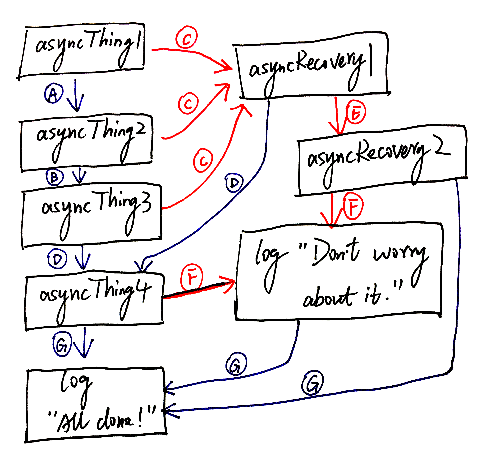

*Please see [here](#references) for the reference list. Demo code [here](https://github.com/fluency03/promise-blog).*


*Promise basics? Please go to my previous blog [Promise Introduction](http://fluency03.com/promise-introduction/).*

<div class="breaker"></div>


In my [previous blog](http://fluency03.com/promise-intoduction/), I have inroduced the basic concepts of Promise. However, simply being able to call `then` or `catch` does not make Promise as powerful and useful as it is. More importantly, it does not solve the issue of [*callback hell*](http://callbackhell.com/). Now, it's time to look at deeper regarding how you can chain `then`s (and `catch`s) together to transform values or run additional async actions one after another (or handle errors at any place you want).

It is `then` method (or, `catch`, or any of these methods), which can return a Promise, makes the Promise chain possible.

Inspired by the example given [here](https://github.com/kriskowal/q), I provide the following example for direclty showing the advantage of chained Promises compared to nested Callbacks.

```javascript
// Nested Callbacks
get('/url', function(error, data) {
  if(!error) {
    step1(data, function (error1, value1) {
      if(!error1) {
        step2(value1, function(error2, value2) {
          if(!error2) {
            step3(value2, function(error3, value3) {
              if(!error3) {
                step4(value3, function(error4, value4) {
                  if(!error4) {
                    // do something with value4
                    console.log(value4);
                  } else {
                    // handle error4
                  }
                });
              } else {
                // handle error3
              }
            });
          } else {
            // handle error2
          }
        });
      } else {
        // handle error1
      }
    });
  } else {
    // handle error
  }
});

// vs

// Chained Promises
var promise = new Promise(function(resolve, reject) {
  var data = get('/url');
  resolve(data);
});

promise.then(promisedStep1)
.then(promisedStep2)
.then(promisedStep3)
.then(promisedStep4)
.then(function (value4) {
  // do something with value4
  console.log(value4);
})
.catch(function (error) {
  // handle any error from all above steps
  console.log(error);
});

```

I think there are two main advantages we can benefit from Promise chain:
1. Much more clear and clean code:
2. Much convinient error handling:

Good to know - Domenic offered 6 points in his [slides](https://www.slideshare.net/domenicdenicola/callbacks-promises-and-coroutines-oh-my-the-evolution-of-asynchronicity-in-javascript) about *"Why promises are awesome"*.

> *Why promises are awesome:*
> - *Cleaner method signatures*
> - *Uniform return/error semantics*
> - *Easy composition*
> - *Easy sequential/parallel join*
> - *Always async*
> - *Exception-style error bubbling*


## Promise Chain

Here's a very good example from [this Google article](https://developers.google.com/web/fundamentals/getting-started/primers/promises):

```javascript
asyncThing1().then(function() {         // (A)
  return asyncThing2();
}).then(function() {                    // (B)
  return asyncThing3();
}).catch(function(err) {                // (C)
  return asyncRecovery1();
}).then(function() {                    // (D)
  return asyncThing4();
}, function(err) {                      // (E)
  return asyncRecovery2();
}).catch(function(err) {                // (F)
  console.log("Don't worry about it");
}).then(function() {                    // (G)
  console.log("All done!");
})
```

The flow chat of above code looks like this:


<figcaption class="caption">Promise States. *Source: [JavaScript Promises: an Introduction](https://developers.google.com/web/fundamentals/getting-started/primers/promises).*</figcaption>


<span style="color:Red">Red arrow</span> represents error flow (i.e., `onRejected`). <span style="color:DarkBlue">Blue arrow</span> represents value flow (i.e., `onFulfilled`).

In detail:

1. **(A), (B), (D), (G)**: If everything went well in `asyncThing1()`, it will point to the next *asyncThing*, which is `asyncThing2()` in this case. Same for `asyncThing2()` to `asyncThing3()`, `asyncThing3()` to `asyncThing4()`, and `asyncThing4()` to `console.log("All done!")`.

2. **\(C\), (F)**: If anything went wrong in either `asyncThing1()`, `asyncThing2()` or `asyncThing3()`, the flow will go to `asyncRecovery1()`, which is the nearest up-coming `catch` after them. Same for `asyncThing4()` and `asyncRecovery2()` to `console.log("Don't worry about it")`.

3. **(D), (E)**: If everything went well in `asyncRecovery1()`, the flow will go to `asyncThing4()`; otherwisre, go to `asyncRecovery2()`.

4. **(G)**: When either `asyncThing4()`, `console.log("Don't worry about it")` or `asyncRecovery2()` is executed successfully, the flow will finally go to `console.log("All done!")`


All of above actions (`asyncThingX()`, `asyncRecoveryX()` and `console.log()`) are ascynchronous.


## Promise Libraries

- [Q](https://github.com/kriskowal/q)
- [RSVP.js](https://github.com/tildeio/rsvp.js)
- [when.js](https://github.com/cujojs/when)
- and a lot more ...


## References

- [Promises/A+ Specifications](https://promisesaplus.com/)
- [JavaScript Promises: an Introduction](https://developers.google.com/web/fundamentals/getting-started/primers/promises)
- [You're Missing the Point of Promises](https://blog.domenic.me/youre-missing-the-point-of-promises/)
- [Ch25: Promises for asynchronous programming, *Exploring ES6*, Dr. Axel Rauschmayer](http://exploringjs.com/es6/ch_promises.html)
- [ES6: ECMAScript® 2015 Language Specification](http://www.ecma-international.org/ecma-262/6.0/index.html#sec-promise-constructor)
- [Callbacks, Promises, and Coroutines (oh my!): Asynchronous Programming Patterns in JavaScript](https://www.slideshare.net/domenicdenicola/callbacks-promises-and-coroutines-oh-my-the-evolution-of-asynchronicity-in-javascript)
